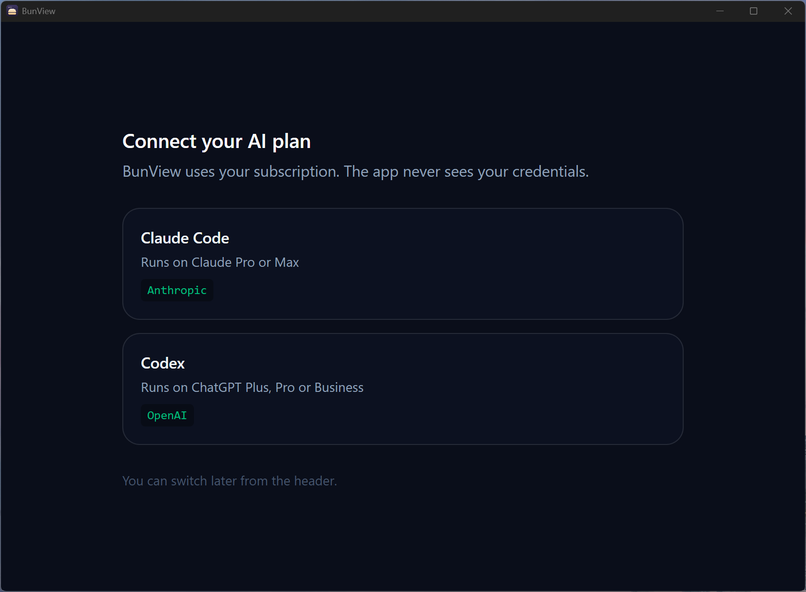
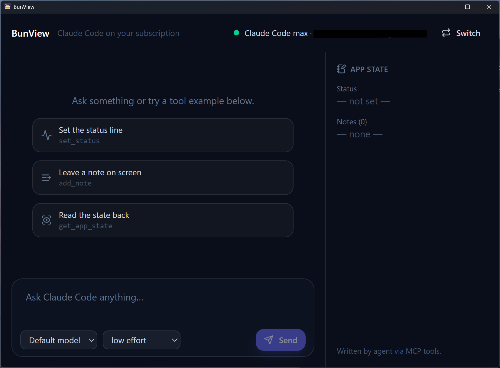

# BunView — A desktop MCP app host using your Claude/ChatGPT subscription

A minimal desktop scaffold for a native app to connect a user's chatGPT/Claude subscription plan. It is a starting point for your own AI apps.

<div align="center">


<br/>


</div>

<table>
  <tr>
    <td width="50%"></td>
    <td width="50%"></td>
  </tr>
  <tr>
    <td align="center"><em>Pick the plan to run on.</em></td>
    <td align="center"><em>The agent writes the right-hand panel through the app's own MCP tools.</em></td>
  </tr>
</table>

## Table of Contents

- [Features](#features)
- [Quickstart](#quickstart)
- [How it works](#how-it-works)
- [Quick Guide Map](#quick-guide-map)
- [Providers](#providers)
- [Prerequisites](#prerequisites)
- [How the agent connection works](#how-the-agent-connection-works)
  - [Prevent accidental API usage](#prevent-accidental-api-usage)
- [MCP: App as the host](#mcp-app-as-the-host)
- [Forking](#forking)
  - [Tools](#tools)
  - [Naming](#naming)
- [Safety defaults](#safety-defaults)
  - [Widening permissions scope](#widening-permissions-scope)
- [Architecture notes](#architecture-notes)
- [Onboarding: Installing agent cli and auth flow](#onboarding-installing-agent-cli-and-auth-flow)
- [Adding a provider](#adding-a-provider)
- [Build](#build)
  - [How to bundle agent deps instead](#how-to-bundle-agent-deps-instead)
- [Frontend fallback](#frontend-fallback)
- [License](#license)

## Features

- Native app executable
- Bun server
- React frontend in WebView
- MCP App host integration
- Example MCP tool use
- Example prompt/response implementation
- Pick AI model/effort parameters

## Quickstart

```bash
bun install
bun run dev
## Tests
bun test
bun run typecheck
```

## How it works

User must choose which plan to connect — Claude Code or Codex.

If the agent CLI is missing, the app offers to install it, downloading the vendor's own signed binary and verifying its checksum. If it is installed but signed out, it offers a Sign in button. Once the header badge shows your plan, the composer unlocks.

The right-hand panel shows an app state the agent can write to via this app's own MCP tools.
Try: **“Set the app status to hello and add a note.”** The panel updates as it answers.

## Quick Guide Map

```
┌─ main.ts ────────────────┐        ┌─ src/server/worker.ts ──────────────┐
│ main thread              │ ready  │ Worker                              │
│ native window (webview)  │◄──────►│ Bun.serve  ─ POST /api/chat  (SSE)  │
│ webview.run() blocks     │  port  │            ─ GET  /api/auth         │
└──────────────────────────┘        │            ─ GET  /api/state        │
                                    │            ─ POST /api/credentials  │
                                    │            ─ /*  bundled React app  │
                                    └───────────────┬─────────────────────┘
                                                    │ Agent SDK
                                                    ▼
                                          claude (native binary)
                                            reads ~/.claude/.credentials.json
                                            ← in-process MCP tools call back
```

## Providers

|                 | Claude Code      | Codex                         |
| --------------- | ---------------- | ----------------------------- |
| Runs on         | Claude Pro / Max | ChatGPT Plus / Pro / Business |
| Streaming       | token by token   | **per message**               |
| App's MCP tools | yes, in-process  | **no**                        |

**Note** What is missing is _BunView's_ tools, the reason is the registration channel. The Claude Agent SDK has a bidirectional control protocol over the same stdio stream it uses to drive the CLI, so `createSdkMcpServer` registers a tool **for one session only** and the handler runs in this process. `codex exec --json` is one-way — prompt in, JSONL out — with no channel to answer on.

It is still doable: Codex reads MCP servers from `~/.codex/config.toml`, and a `url` entry there uses streamable HTTP, so BunView could serve `POST /mcp` from the Bun server it already runs and keep the tools in-process after all. The costs are what stopped it — it writes to the user's **global** config rather than being scoped to a session, it currently needs `experimental_use_rmcp_client = true`, and it means implementing the MCP wire protocol rather than calling a helper.

## Prerequisites

|             |                                                                                                                                  |
| ----------- | -------------------------------------------------------------------------------------------------------------------------------- |
| Bun         | ≥ 1.3.9 (`--watch=always` is used in dev)                                                                                        |
| Claude Code | none — the app can install it. Or `curl -fsSL https://claude.ai/install.sh \| bash` / `irm https://claude.ai/install.ps1 \| iex` |
| Windows     | Nothing                                                                                                                          |
| macOS       | Nothing; WKWebView is built in                                                                                                   |
| Linux       | GTK 4 + WebKitGTK 6 — `apt install libgtk-4-1 libwebkitgtk-6.0-4` / `pacman -S gtk4 webkitgtk-6.0`                               |

Desktop only. The whole design spawns a local process, which is not supported on Android, iOS. A mobile client could use Tauri instead of Bun to get around this.

## How the agent connection works

`claude auth login` writes OAuth credentials to `~/.claude/.credentials.json` (or the OS keychain), and the agent binary reads them when the app spawns it. Usage bills against your Pro/Max quota and obeys its rate limits.

### Prevent accidental API usage

If `ANTHROPIC_API_KEY` is set in the environment, the CLI prefers it and bills API credits instead of your plan. BunView **defaults to your plan** and makes the other choice visible rather than hidden:

- **Default `subscription`.** [`src/server/env.ts`](src/server/env.ts) strips `ANTHROPIC_API_KEY`, `ANTHROPIC_AUTH_TOKEN`, `ANTHROPIC_BASE_URL` and the Bedrock/Vertex switches from the CLIs BunView spawns, so a key you exported for unrelated work does not quietly spend your card here.
- The badge reports which credential is actually used — from the CLI's own `apiKeySource`, not from a guess.
- When a key is present, the header offers **Use my plan** / **Use API key**. With no key present the switch is hidden, because there is no second option.
- `BUNVIEW_CREDENTIAL_MODE=auto` starts in pass-through mode, which is the binary's own precedence.

**Why the default is bounded.** Anthropic's [terms](https://code.claude.com/docs/en/legal-and-compliance) for running Claude Code inside another product require that the binary run as published and that the host not "remove, disable, or restrict any authentication method built into it.

`GET /api/auth?provider=<id>` shells the vendor's status command (`claude auth status --json`, `codex login status`) and reports which credential is actually in play, so the badge says _“Claude max · you@example.com”_ on a subscription and warns _“API key — usage is billed per token”_ when it is not. When that key came from `apiKeyHelper` or a managed `/login` key — settings BunView cannot reach, so no switch is offered — the badge tooltip names the source, since the fix is in your Claude settings rather than in this app.

## MCP: The App is the host

This app is an MCP **host**, and it registers its _own_ MCP server into the agent session so the agent can call tools that change the app's live state.

[`src/server/mcp/app-tools.ts`](src/server/mcp/app-tools.ts):

```ts
export const appToolsServer = createSdkMcpServer({
  name: 'bunview',
  tools: [
    tool('set_status', '…', { text: z.string() }, async ({ text }) => ok(setStatus(text))),
    // …
  ],
})
```

`createSdkMcpServer` runs these **in this process**. The handlers close over [`src/server/state.ts`](src/server/state.ts), so a tool call mutates the same object the UI is rendering. A stdio MCP server would instead put a process boundary between the agent's tools and your app's state; an HTTP one keeps them together but means implementing the wire protocol and registering it globally.

## Forking

### Tools

Delete the three example tools and register your own.

### Naming

The BunView name is carried across code, build config and CI.

**Rename in lockstep:**

- [ ] **Binary identity** — `APP_NAME`, `DISPLAY_NAME`, `BUNDLE_ID`, `PUBLISHER`, `COPYRIGHT_YEAR`
      in [build.ts:24-36](build.ts#L24-L36), **and** both of its downstream consumers:
      [`.gitignore:5-8`](.gitignore#L5-L8), which excludes the built binary _by literal name_ —
      miss it and your new multi-megabyte executable starts getting committed — and
      [`release.yml:52-80`](.github/workflows/release.yml#L52-L80), which builds every artifact
      name from `APP_NAME` and probes for `${DISPLAY_NAME}-macos.app` on line 60.
- [ ] **MCP server name** — [`app-tools.ts:27`](src/server/mcp/app-tools.ts#L27) `name: 'bunview'`
      **and** the `mcp__bunview__*` glob in `BUNVIEW_ALLOWED_TOOLS` at
      [`config.ts:171`](src/server/config.ts#L171). Tool IDs are built from that name, so changing
      one side alone means every call to your own tools is silently denied.
- [ ] **localStorage key** — `PROVIDER_KEY` in
      [`Chat.tsx:22`](src/client/components/Chat.tsx#L22) **and** the same literal in
      [`Chat.test.tsx:16`](src/client/components/Chat.test.tsx#L16).
- [ ] **Data folder** — the three `'BunView'` arms of
      [`platform.ts:92-97`](src/server/install/platform.ts#L92-L97). Renaming this after you ship
      orphans any CLI a user already installed, and the app offers to download it again.

**Safe to rename any time:**

- [ ] **Package metadata** — `name`, `description`, `repository` in
      [package.json](package.json#L2-L11).
- [ ] **Copyright holder** — [LICENSE](LICENSE#L3). Leave the rest of that file byte-for-byte or
      GitHub stops detecting the license.
- [ ] **Env prefix** — 16 `BUNVIEW_*` vars across [src/server/](src/server/), plus the Safety
      defaults table below.
- [ ] **Titles** — the console banner at [main.ts:198](main.ts#L198), the native window title at
      [main.ts:217](main.ts#L217), and the page title at
      [`index.html:7`](src/client/index.html#L7). All three are separate.
- [ ] **UI copy** — the header in [Chat.tsx:111](src/client/components/Chat.tsx#L111), the prose in
      [ProviderPicker.tsx:18](src/client/components/ProviderPicker.tsx#L18) and
      [SetupBanner.tsx:109-110](src/client/components/SetupBanner.tsx#L109-L110), and the
      `cli_missing` message at [`events.ts:47`](src/shared/events.ts#L47).
- [ ] **Icon** — `assets/icon.svg` has the wordmark set as live text, so edit it there, then
      regenerate `assets/icon.ico` from it. Only the `.ico` is read at build time;
      [build-icons.ts](build-icons.ts) decodes it into the `.icns` and `.png` that macOS and Linux
      want, so the `.ico` is the one that must actually change.

## Safety defaults

Read-only.

| Env var                                | Default                          | Effect                                                                |
| -------------------------------------- | -------------------------------- | --------------------------------------------------------------------- |
| `BUNVIEW_TOOLS`                        | `Read,Grep,Glob`                 | **The fence.** Built-in tools that exist at all; set-but-empty = none |
| `BUNVIEW_ALLOWED_TOOLS`                | `Read,Grep,Glob,mcp__bunview__*` | Pre-approved, so no prompt can arise in a headless session            |
| `BUNVIEW_PERMISSION_MODE`              | `dontAsk`                        | `bypassPermissions` additionally requires `BUNVIEW_ALLOW_BYPASS=1`    |
| `BUNVIEW_SETTING_SOURCES`              | _(empty)_                        | Do not inherit the user's CLAUDE.md, skills, hooks or MCP servers     |
| `BUNVIEW_CWD`                          | `homedir()`                      | Session bucket, and the only directory the file tools can reach       |
| `BUNVIEW_MODEL`                        | _(CLI default)_                  | Claude only. Also selectable per-message in the UI                    |
| `BUNVIEW_CODEX_SANDBOX`                | `read-only`                      | Codex only. `workspace-write` / `danger-full-access`. See below       |
| `BUNVIEW_CLAUDE_PATH`                  | _(discovered)_                   | Explicit path to the Claude binary                                    |
| `BUNVIEW_CODEX_PATH`                   | _(discovered)_                   | Explicit path to the Codex binary                                     |
| `BUNVIEW_ALLOW_INSTALL`                | `1`                              | Offer to install a missing CLI. Set `0` for managed/offline builds    |
| `BUNVIEW_CREDENTIAL_MODE`              | `subscription`                   | `auto` lets the CLI prefer `ANTHROPIC_API_KEY`. Switchable in the UI  |
| `BUNVIEW_STALL_MS` / `BUNVIEW_WALL_MS` | `120000` / `600000`              | Silence cap / total cap                                               |
| `BUNVIEW_PORT`                         | `0`                              | `0` = ephemeral                                                       |

Three things are worth knowing about the defaults:

- **`settingSources: []` is not tidiness.** With the default, the session inherits every MCP server in the user's `~/.claude.json`. On a working developer machine that can mean Gmail, Drive and Calendar.
- **`tools` is an allowlist, and `allowedTools` is not a fence.** They read alike and do opposite jobs. The SDK's own doc comment is explicit: `allowedTools` is "tool names that are auto-allowed without prompting… **To restrict which tools are available, use the `tools` option instead.**" So `tools` is what makes Bash, Write and Edit _absent_ — which also means a tool added by a future CLI release is excluded automatically, where a denylist would have permitted it until someone noticed. `mcp__bunview__*` arrives through `mcpServers` and is unaffected, so even `BUNVIEW_TOOLS=` leaves the app's own tools working.
- **The fence is built from typed SDK options, not a raw CLI flag.** `tools` removes the tools that run commands or code; `permissionMode: 'dontAsk'` denies anything unlisted instead of prompting into a window with nowhere to show a prompt; `canUseTool` backstops the rest; the CLI confines file tools to `cwd` unless something passes `--add-dir`, which nothing here does; `settingSources: []` ignores user/project/local settings; and `bypassPermissions` is refused at startup unless `BUNVIEW_ALLOW_BYPASS=1` is set alongside it. Prefer typed options over `extraArgs`: that is unchecked passthrough to a binary this app does not version-pin.

**Never add `--bare`.** otherwise the sdk will use `ANTHROPIC_API_KEY` and bill based on API usage instead.

### Widening permissions scope

If your app needs to read a project directory:

```bash
BUNVIEW_CWD="/path/to/project" bun run dev
```

The defaults already allow `Read,Grep,Glob`, so pointing `cwd` somewhere is the whole change. The file tools are then confined to that directory — the CLI scopes them to `cwd`, and nothing here passes `--add-dir` to widen it.

To grant a tool that is not in the defaults, add it to **both** lists — `BUNVIEW_TOOLS` so it exists, and `BUNVIEW_ALLOWED_TOOLS` so it does not raise a prompt this app cannot display:

```bash
BUNVIEW_TOOLS="Read,Grep,Glob,WebFetch" \
BUNVIEW_ALLOWED_TOOLS="Read,Grep,Glob,WebFetch,mcp__bunview__*" \
bun run dev
```

### Codex on Windows cannot read anything under the default sandbox

- **Claude** uses in-process tools. `BUNVIEW_TOOLS=Read,Grep,Glob` needs no shell at all.
- **Codex** has no in-process file tools. Every read it performs is a shell command, and on Windows that shell is PowerShell (`pwsh.exe`, then `powershell.exe`, off PATH).

Under any `sandbox_mode` but `danger-full-access`, that command has to run inside Codex's own sandbox — and on Windows the sandbox is still behind a vendor feature flag (`experimental_windows_sandbox`, with a `codex-windows-sandbox-setup.exe` helper shipped next to the binary).

```bash
BUNVIEW_CODEX_SANDBOX=danger-full-access bun run dev
```

`read-only` stays the default. macOS and Linux have a working sandbox and need none of this.

## Architecture notes

The webview owns the main thread. `webview.run()` runs a blocking native event loop, so a `Bun.serve` on the same thread would register with an event loop that never runs again and every request would hang. The server therefore lives in a Worker, and the two meet once, at the `{ type: 'ready', port }` handshake.

`main.ts` must stay at the repo root, and the Worker specifier must stay a string literal. Bun discovers worker modules by static analysis of `new Worker('./src/server/worker.ts')` — wrapping it in `new URL(…, import.meta.url)` silently omits the module from the compiled binary. And a plain specifier resolves against the bunfs root, which is the common ancestor of `build.ts`'s `entrypoints`; keeping `main.ts` at the root makes that the repo root so the path means the same thing in dev and in the executable.

**Events are a closed union.** [`src/shared/events.ts`](src/shared/events.ts) defines every shape the browser can see, and [`claude-map.ts`](src/server/providers/claude-map.ts) maps the agent's messages onto it, dropping anything unrecognised. That keeps an unversioned internal wire format out of the UI, keeps the provider seam real, and — importantly — keeps tool _inputs_ off the wire, since an `Edit` tool's input is file contents. Tool events carry a name and nothing else.

**Cancellation has three independent paths**: the client's `AbortController`, the server listening to both `req.signal` and the stream's `cancel()`, and a process-exit sweep in [`proc.ts`](src/server/proc.ts). The last one matters because neither `worker.terminate()` nor `process.exit()` reaps a grandchild — without it, closing the window mid-answer leaves an agent running against your plan.

**SSE, not `EventSource`.** EventSource cannot POST, cannot set headers, and auto-reconnects when the server closes the stream — which for a one-shot completion re-fires the whole prompt the moment the answer finishes.

## Onboarding: Installing agent cli and auth flow

Two endpoints reach outside the app's own process, and both are gated behind an explicit click that shows what will run first:

- **`POST /api/install`** downloads the vendor's own signed binary into BunView's data folder
  and verifies its SHA-256, streaming progress back as SSE. Afterwards it clears the discovery
  cache and re-detects, so the new binary is found without a restart.
  `BUNVIEW_ALLOW_INSTALL=0` removes the button entirely.

  What [`install/`](src/server/install/) does instead is what the vendors' own `install.sh` /
  `install.ps1` do — read the release manifest, download the platform binary, verify the
  checksum — minus the shell. No npm, no Node, no shell, no admin rights. The binaries arrive
  Developer ID-signed and Apple-notarized (they are the vendor's, unmodified), and a file
  fetched programmatically carries no `com.apple.quarantine`, so Gatekeeper does not gate it.
  BunView adds no signing obligations of its own.

  It installs to the app's data folder and **not** onto PATH — `%LOCALAPPDATA%\BunView`,
  `~/Library/Application Support/BunView`, or `$XDG_DATA_HOME/BunView`. Discovery checks it
  **last**, so a `claude` the user installed themselves stays authoritative; these tools share
  state under `~/.claude` / `~/.codex`. Uninstalling is deleting the folder.

  Nothing auto-installs.

- **`POST /api/login`** opens the vendor's sign-in command **in a real terminal window** rather
  than driving it headless through pipes. Both vendors' login flows are interactive — they open
  a browser, run a localhost callback listener, and may print a code to confirm.

## Adding a provider

Implement [`Provider`](src/server/providers/types.ts) — `detect()`, `authStatus()`, `stream()` — in a file beside `claude.ts` and `codex.ts`, add it to `PROVIDERS` in [`shared/events.ts`](src/shared/events.ts) and to the registry in [`providers/index.ts`](src/server/providers/index.ts). Because `stream()` yields only `AppEvent`, the frontend needs no changes — it cannot tell the vendors apart.

### Per-provider parameters

`models`, `efforts` and `settings` on `ProviderInfo` are what the composer renders and what [`chat.ts`](src/server/chat.ts) validates against. **These are per vendor and must not be shared.**

|         | Claude Code                           | Codex                                              |
| ------- | ------------------------------------- | -------------------------------------------------- |
| Models  | `opus`, `sonnet`, `haiku`, `fable`    | `gpt-6-astra`, `gpt-5.6-sol/terra/luna`, `gpt-5.5` |
| Efforts | `low`→`max` (the SDK's `EffortLevel`) | `minimal`→`xhigh` (`model_reasoning_effort`)       |
| Extra   | `thinking`                            | `verbosity`, `summary`                             |

Both lists put the vendor's own default model first.

`settings` is a declared list rather than named fields, so adding a knob is a data change here and no branch in the composer. Keep them to **quality and presentation**. The sandbox, tool list and permission mode come from the environment on purpose (see [Safety defaults](#safety-defaults)); putting any of them behind a dropdown hands every user a control the safety posture assumes nobody has.

Discovery is shared: [`discovery.ts`](src/server/providers/discovery.ts) takes a `CliSpec` (binary name, npm package, path to the real entry point) and returns a spawnable **argv** rather than a bare path.

It tries five rungs, in this order:

1. `BUNVIEW_<PROVIDER>_PATH`, if set. A wrong override is a hard failure, never a silent fallthrough.
2. `PATH`. On Windows this is an npm shim, which is resolved to the real executable rather than run — see the header comment in `discovery.ts` for why routing a chat prompt through `cmd.exe` is not an acceptable degradation.
3. Well-known install locations, because a GUI-launched app does not inherit the login shell's `PATH`.
4. **The binary the Agent SDK shipped for this platform** — `@anthropic-ai/claude-agent-sdk-<platform>-<arch>`, which npm installs as an optional dependency of the SDK. It is a real executable at a known path, version-matched to the SDK that will drive it, so in dev the npm-shim problem never arises. Resolution failing is normal and silent: a compiled build has no `node_modules`.
5. BunView's own managed copy, last, so a CLI the user installed themselves always wins.

## Build

```bash
bun run build        # host platform  -> ./bunview[.exe]
bun run build:all    # five targets   -> dist/
```

- The Windows binary stays on the **CONSOLE** subsystem and hides its own console window at
  runtime (`hideOwnConsoleWindow()` in [main.ts](main.ts)).
- The Windows binary also carries an icon, version, publisher, description and copyright in its
  VERSIONINFO resource. The _running window_ gets its icon separately, from `setWindowIcon()` in
  [main.ts](main.ts) — Windows treats the file icon and the window icon as unrelated.
- macOS gets a `.app` bundle with a `.icns` and an ad-hoc signature. Distributing to other Macs
  still needs a Developer ID and notarization.
- Linux gets a `.desktop` file plus the `.png` its `Icon=` points at. Both that path and `Exec=`
  are absolute paths on the _build_ machine, so they need rewriting if the zip is unpacked
  elsewhere.
- All three icons come from the one committed `assets/icon.ico`:
  [build-icons.ts](build-icons.ts) decodes its DIB entries and re-encodes them as PNG and ICNS,
  so there is a single artefact to keep in step with `assets/icon.svg`.
- Tailwind runs **before** the bundler: `generated.css` is an _input_ (the HTML links it).

The compiled binary spawns the _system_ `claude`, resolved at runtime.

### How to bundle agent deps instead

To ship an app that needs no separate CLI install, bundle the platform binary instead:

```ts
import binPath from '@anthropic-ai/claude-agent-sdk-darwin-arm64/claude' with { type: 'file' }
import { extractFromBunfs } from '@anthropic-ai/claude-agent-sdk/extract'
// pathToClaudeCodeExecutable: extractFromBunfs(binPath)
```

`require.resolve` cannot see into the compiled `$bunfs`, which is what `extractFromBunfs` (SDK ≥ 0.3.144) exists for.

Not used here because `build:all` cross-compiles five targets, and a static `import … with { type: 'file' }` would need all eight per-platform packages installed to do that. Note the asymmetry if you only ship your own platform: `bun run build` needs exactly one package, and it is already installed — so a host-target build could embed the binary and skip the installer entirely, leaving `POST /api/install` as the path for cross-compiled artifacts only.

In **dev** none of this applies: discovery rung 4 above already finds that same per-platform binary in `node_modules`, so a working `claude` is present from `bun install` alone.

## Frontend fallback

The frontend is bundled by Bun's HTML entrypoint, imported inside the Worker. If a future Bun release breaks that under `--compile`, pre-bundle in `build.ts` and serve the output through `with { type: 'file' }` imports (that is what `declarations.d.ts` is for). This loses HMR, so it is a deliberate edit rather than a runtime switch.:

```ts
await Bun.build({
  entrypoints: ['./src/client/index.html'],
  outdir: './dist/client',
  naming: { entry: '[name].[ext]', asset: '[name].[ext]' }, // no hashes: specifiers must be writable
  splitting: false, // no unnamed shared chunk
  minify: true,
})
```
